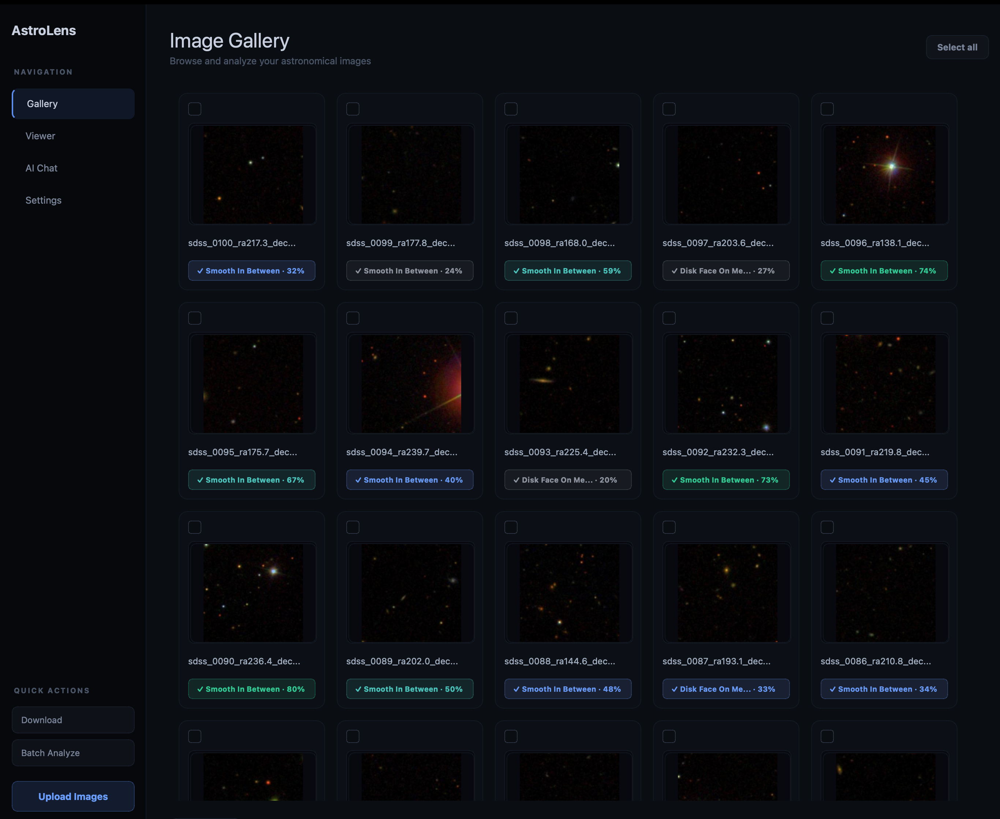
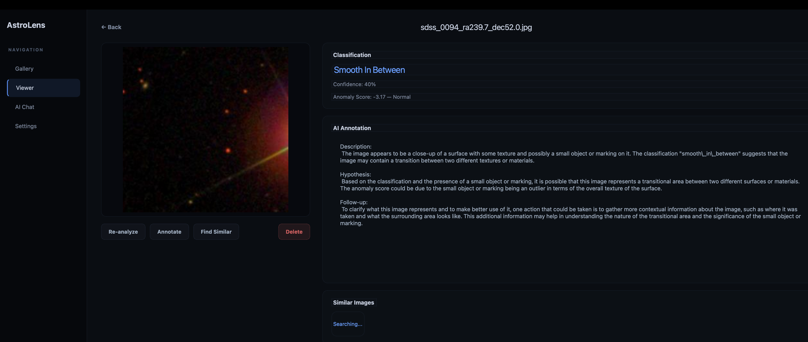

# 🔭 AstroLens

<p align="center">
  
</p>

<p align="center">
  <strong>AI-Powered Astronomical Anomaly Discovery System</strong><br>
  <em>Discover what the universe is hiding</em>
</p>

<p align="center">
  <a href="#features">Features</a> •
  <a href="#quick-start">Quick Start</a> •
  <a href="#how-it-works">How It Works</a> •
  <a href="#screenshots">Screenshots</a> •
  <a href="#architecture">Architecture</a>
</p>

---

## What is AstroLens?

AstroLens is an **autonomous astronomical anomaly discovery system** that continuously scans astronomical image sources, uses advanced AI to detect unusual objects, and cross-references findings against major astronomical catalogs to identify potentially new discoveries.

Unlike traditional tools that require manual image analysis, AstroLens runs **24/7 in the background**, automatically downloading, analyzing, and learning from thousands of astronomical images.

## What Makes AstroLens Unique?

| Feature | AstroLens | Traditional Tools |
|---------|-----------|-------------------|
| **Autonomous Discovery** | Runs continuously, discovers anomalies while you sleep | Manual image-by-image review |
| **Self-Improving AI** | Fine-tunes on discoveries, gets smarter over time | Static models |
| **Multi-Source Ingestion** | SDSS, Galaxy Zoo, ZTF, NASA APOD | Single source |
| **Catalog Cross-Reference** | Auto-queries SIMBAD, NED, VizieR | Manual lookup |
| **Out-of-Distribution Detection** | Ensemble OOD (MSP + Energy + Mahalanobis) | Simple thresholding |
| **Near-Miss Tracking** | Saves borderline cases for review | Binary yes/no |
| **Adaptive Thresholds** | Auto-calibrates based on data | Fixed thresholds |

## Features

### 🔍 Autonomous Discovery Loop
- Continuously downloads from multiple astronomical sources
- Analyzes every image with state-of-the-art Vision Transformer
- Tracks anomalies, near-misses, and uncertain detections
- Runs in the background with system notifications

### 🧠 Self-Improving Model
- Fine-tunes on Galaxy Zoo, Galaxy10, and discovered anomalies
- Tracks accuracy improvements over training runs
- Model accuracy: **83.9%** with **+4.9% improvement** from fine-tuning

### 🌌 Multi-Catalog Cross-Reference
- Queries **SIMBAD**, **NED**, and **VizieR** (SDSS DR12)
- Identifies if detections are known objects or potential discoveries
- Human verification workflow for true/false positive labeling

### 📊 Advanced OOD Detection
- **Ensemble voting** with 3 methods:
  - Maximum Softmax Probability (MSP)
  - Energy-based detection
  - Mahalanobis distance
- Auto-calibration for optimal thresholds
- Aggressive mode for maximizing discovery rate

### 🖥️ Premium Desktop Interface
- Modern dark theme with smooth animations
- Real-time discovery statistics
- Image gallery with zoom and analysis
- Verification panel for catalog cross-reference

## Screenshots

<p align="center">
  
  <br><em>Discovery Panel - Real-time anomaly detection</em>
</p>

<p align="center">
  
  <br><em>Verification Panel - Cross-reference against astronomical catalogs</em>
</p>

<p align="center">
  
  <br><em>Gallery View - Browse and analyze discoveries</em>
</p>

## Quick Start

### Prerequisites
- Python 3.10+
- 8GB+ RAM recommended
- GPU optional but speeds up inference

### Installation

```bash
# Clone the repository
git clone https://github.com/yourusername/astrolens.git
cd astrolens

# Create virtual environment
python -m venv .venv
source .venv/bin/activate  # On Windows: .venv\Scripts\activate

# Install dependencies
pip install -r requirements.txt

# Download pre-trained weights
python scripts/download_weights.py
```

### Running AstroLens

```bash
# Start the API server
uvicorn api.main:app --port 8000

# In another terminal, launch the desktop app
python -m ui.app

# Or run autonomous discovery loop
python scripts/discovery_loop.py
```

### Docker (Alternative)

```bash
docker-compose up -d
```

## How It Works

```
┌─────────────────────────────────────────────────────────────────┐
│                    AUTONOMOUS DISCOVERY LOOP                     │
├─────────────────────────────────────────────────────────────────┤
│                                                                  │
│   ┌──────────┐    ┌──────────┐    ┌──────────┐    ┌──────────┐  │
│   │  Source  │───▶│ Download │───▶│ Analyze  │───▶│  Detect  │  │
│   │ Manager  │    │  Images  │    │  (ViT)   │    │   OOD    │  │
│   └──────────┘    └──────────┘    └──────────┘    └────┬─────┘  │
│                                                        │         │
│   ┌──────────────────────────────────────────────────┐ │         │
│   │                    RESULTS                        │◀┘         │
│   ├──────────────────────────────────────────────────┤           │
│   │  ★ Anomaly      → Save + Notify + Cross-Ref     │           │
│   │  ◐ Near-miss    → Save for review               │           │
│   │  ○ Normal       → Track for training            │           │
│   └──────────────────────────────────────────────────┘           │
│                          │                                       │
│                          ▼                                       │
│   ┌──────────────────────────────────────────────────┐           │
│   │              CONTINUOUS FINE-TUNING              │           │
│   │  Galaxy10 • Galaxy Zoo • Discovered Anomalies    │           │
│   └──────────────────────────────────────────────────┘           │
│                                                                  │
└─────────────────────────────────────────────────────────────────┘
```

## Architecture

```
astrolens/
├── api/                    # FastAPI backend
│   ├── main.py            # API endpoints
│   ├── models.py          # Pydantic schemas
│   └── db.py              # SQLite database
├── inference/              # AI inference
│   ├── classifier.py      # ViT-based classifier
│   ├── ood.py             # Out-of-distribution detection
│   ├── embeddings.py      # FAISS similarity search
│   └── duplicates.py      # Perceptual hashing
├── catalog/                # Astronomical catalogs
│   └── cross_reference.py # SIMBAD, NED, VizieR queries
├── finetuning/             # Model training
│   ├── train.py           # Fine-tuning script
│   ├── evaluate.py        # Evaluation metrics
│   └── pipeline.py        # Training pipeline
├── scripts/                # Automation
│   └── discovery_loop.py  # Autonomous discovery
├── ui/                     # Desktop interface
│   ├── app.py             # Main application
│   ├── discovery_panel.py # Discovery controls
│   ├── verification_panel.py # Cross-reference UI
│   └── gallery.py         # Image gallery
└── annotator/              # LLM integration
    └── chain.py           # GPT/Ollama analysis
```

## Configuration

### Environment Variables

```bash
# Optional: LLM provider for image description
export LLM_PROVIDER=ollama  # or "openai"
export OPENAI_API_KEY=sk-...  # if using OpenAI

# Optional: NASA API for more APOD images
export NASA_API_KEY=...
```

### Discovery Settings

Edit `scripts/discovery_loop.py` or use CLI flags:

```bash
# Aggressive mode (more detections)
python scripts/discovery_loop.py --aggressive

# Custom cycle interval
python scripts/discovery_loop.py --interval 600

# Force OOD calibration
python scripts/discovery_loop.py --calibrate
```

## API Reference

| Endpoint | Method | Description |
|----------|--------|-------------|
| `/health` | GET | Health check |
| `/images` | GET | List all images |
| `/images/{id}` | GET | Get image details |
| `/candidates` | GET | List anomaly candidates |
| `/analyze/{id}` | POST | Analyze an image |
| `/crossref/{id}` | POST | Cross-reference against catalogs |
| `/crossref/summary` | GET | Cross-reference statistics |

## Model Performance

| Metric | Value |
|--------|-------|
| **Galaxy Classification Accuracy** | 83.9% |
| **Training Improvement** | +4.9% |
| **OOD Detection Methods** | MSP, Energy, Mahalanobis |
| **Catalog Sources** | SIMBAD, NED, VizieR/SDSS |
| **Inference Time** | ~274ms per image (CPU) |

## Contributing

Contributions are welcome! Please read our contributing guidelines and submit pull requests.

1. Fork the repository
2. Create a feature branch (`git checkout -b feature/amazing-feature`)
3. Commit changes (`git commit -m 'Add amazing feature'`)
4. Push to branch (`git push origin feature/amazing-feature`)
5. Open a Pull Request

## License

This project is licensed under the MIT License - see the [LICENSE](LICENSE) file for details.

## Acknowledgments

- [Hugging Face](https://huggingface.co/) for Vision Transformer models
- [Galaxy Zoo](https://www.zooniverse.org/projects/zookeeper/galaxy-zoo/) for citizen science data
- [SIMBAD](http://simbad.u-strasbg.fr/) for astronomical database access
- [NED](https://ned.ipac.caltech.edu/) for extragalactic data
- [SDSS](https://www.sdss.org/) for galaxy survey data

## Author

**Saman Tabatabaeian**

- Email: saman.tabatabaeian@gmail.com
- LinkedIn: [linkedin.com/in/samantabatabaeian](https://www.linkedin.com/in/samantabatabaeian/)
