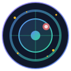

<p align="center">
  
</p>

<h1 align="center">AstroLens</h1>

<p align="center">
  <strong>Autonomous AI-powered astronomical image analysis with ML classification, ensemble anomaly detection, and continuous model improvement.</strong>
</p>

<p align="center">
  
  
  
  
  
</p>

---

## Overview

AstroLens is a local-first desktop application for intelligent image analysis:

- **Upload images** (FITS, PNG, JPEG) via drag-and-drop or file picker
- **Classify** objects using a fine-tuned Vision Transformer (ViT)
- **Detect anomalies** with energy-based out-of-distribution detection
- **Find similar** images using embedding similarity (FAISS)
- **Get LLM insights** via natural language (OpenAI or local Ollama)
- **Chat with an AI agent** to explore your image collection

All processing runs **locally** – no cloud required. Optional LLM features work with OpenAI API or fully offline with Ollama.

---

## Features

### Core Capabilities

| Feature | Description |
|---------|-------------|
| **ML Classification** | Fine-tuned ViT-B/16 classifies into 10 galaxy morphology categories |
| **Ensemble Anomaly Detection** | Energy + MSP + Mahalanobis voting for robust OOD detection |
| **Autonomous Discovery** | 24/7 background loop downloads, analyzes, and hunts for anomalies |
| **Continuous Fine-Tuning** | Automatic model improvement with rotating datasets |
| **Real Anomaly Ingestion** | Downloads verified supernovae, lenses, mergers from catalogs |
| **Improvement Tracking** | Tracks model accuracy gains across training runs |

### Image Management

| Feature | Description |
|---------|-------------|
| **Multi-Format Support** | FITS, PNG, JPEG with drag-and-drop or batch import |
| **Embedding Search** | 768-dim FAISS vectors for "find similar" queries |
| **Duplicate Detection** | Perceptual hashing prevents redundant images |
| **Batch Analysis** | Analyze thousands of images with progress tracking |
| **Active Learning** | Flags uncertain samples for human review |

### AI & Intelligence

| Feature | Description |
|---------|-------------|
| **LLM Annotation** | GPT-4o or local Ollama generates descriptions |
| **Chat Agent** | LangChain agent with tools: analyze, search, annotate, export |
| **Hypothesis Generation** | AI suggests what anomalies might represent |

### Technical

| Feature | Description |
|---------|-------------|
| **Desktop UI** | Elegant PyQt5 interface with modern dark theme |
| **GPU Acceleration** | Apple MPS (Mac) and CUDA (Linux/Windows) support |
| **Containerized** | Docker Compose for one-command backend startup |
| **API-first** | FastAPI backend; UI is a decoupled client |
| **Local-first** | All ML runs locally; cloud LLM is optional |

---

## Quick Start

### Option 1: Docker (Recommended)

```bash
# Clone
git clone https://github.com/samantaba/AstroLens.git
cd AstroLens

# Start API backend
docker-compose up -d

# Run PyQt5 UI (requires Python on host)
pip install -r requirements.txt
python -m ui.main
```

### Option 2: Local Python

```bash
# Clone and setup
git clone https://github.com/samantaba/AstroLens.git
cd AstroLens
python3 -m venv .venv
source .venv/bin/activate
pip install -r requirements.txt

# Download ML weights (first run)
python scripts/download_weights.py

# Start API
uvicorn api.main:app --reload --port 8000

# In another terminal, start UI
python -m ui.main
```

### Option 3: Fully Offline (with Ollama)

```bash
# Install Ollama
brew install ollama  # macOS
# or: curl -fsSL https://ollama.com/install.sh | sh  # Linux

# Pull vision model
ollama pull llava

# Start AstroLens with local LLM
export LLM_PROVIDER=ollama
docker-compose up -d
python -m ui.main
```

---

## Architecture

```
┌─────────────────────────────────────────────────────────────────────┐
│                      PyQt5 DESKTOP UI                               │
│  Gallery │ Viewer │ Analysis │ Chat │ Settings                      │
└─────────────────────────────────┬───────────────────────────────────┘
                                  │ HTTP
                                  ▼
┌─────────────────────────────────────────────────────────────────────┐
│                     FASTAPI BACKEND                                 │
│  /images │ /analysis │ /annotate │ /chat │ /candidates             │
└─────────────────────────────────┬───────────────────────────────────┘
                                  │
          ┌───────────────────────┼───────────────────────┐
          ▼                       ▼                       ▼
┌──────────────────┐   ┌──────────────────┐   ┌──────────────────┐
│   ML INFERENCE   │   │   LLM ANNOTATOR  │   │  LANGCHAIN AGENT │
│   (ViT + OOD)    │   │   (GPT/Ollama)   │   │   (tools)        │
└──────────────────┘   └──────────────────┘   └──────────────────┘
          │                       │                       │
          └───────────────────────┴───────────────────────┘
                                  │
                                  ▼
┌─────────────────────────────────────────────────────────────────────┐
│                        DATA LAYER                                   │
│  SQLite (metadata) │ Local Files (images/) │ FAISS (embeddings)    │
└─────────────────────────────────────────────────────────────────────┘
```

---

## Autonomous Discovery Loop

AstroLens includes an autonomous discovery system that continuously hunts for astronomical anomalies 24/7:

1. **Downloads** images from 8+ sources (SDSS, ZTF, NASA APOD, ESO, Galaxy Zoo, and more)
2. **Ingests real anomalies** from verified catalogs (supernovae, gravitational lenses, galaxy mergers)
3. **Analyzes** each image with ensemble OOD detection
4. **Flags** potential anomalies for human review
5. **Fine-tunes** the model continuously to improve detection
6. **Tracks improvement** metrics across training runs

### Running the Discovery Loop

```bash
# Start from UI: Discovery Panel → Start Discovery

# Or from command line:
python scripts/discovery_loop.py                # Normal mode
python scripts/discovery_loop.py --aggressive   # 30-sec cycles, lower thresholds
python scripts/discovery_loop.py --turbo        # Maximum speed, 5-sec cycles
```

### Real Anomaly Sources

The discovery loop ingests **verified anomalies** from astronomical catalogs:

| Source | Type | Description |
|--------|------|-------------|
| **IAU Transient Name Server** | Supernovae | Real confirmed supernova events |
| **Master Lens Database** | Gravitational Lenses | Known strong lensing systems |
| **Galaxy Zoo** | Mergers & Peculiar | Citizen-science classified oddities |
| **SDSS Special Objects** | Various | Spectroscopically confirmed unusual objects |

### Ensemble Anomaly Detection

The detection system uses **3 complementary methods** that vote:

| Method | What It Measures |
|--------|------------------|
| **Energy Score** | Overall model confidence (higher = more unusual) |
| **MSP (Max Softmax Prob)** | Highest class probability (lower = more uncertain) |
| **Mahalanobis Distance** | Distance from known class distributions |

An image is flagged as anomaly if **2+ methods agree** it's out-of-distribution.

### Continuous Model Improvement

The discovery loop tracks model performance across training runs:

- **Accuracy tracking** before and after each fine-tuning run
- **Improvement metrics** showing total gain since initial training  
- **Training history** with per-run statistics
- **Automatic dataset enrichment** from downloaded anomalies

---

## ML vs LLM: What Each Does

| | **ML (Machine Learning)** | **LLM (Large Language Model)** |
|--|---------------------------|--------------------------------|
| **Purpose** | Classify images, detect anomalies | Generate text, answer questions |
| **Model** | ViT-B/16 (fine-tuned) | GPT-4o / LLaVA |
| **Runs** | Always locally | OpenAI API or local Ollama |
| **We train?** | No – use pre-trained weights | No – use via API |
| **Output** | Class labels, scores, vectors | Natural language text |

---

## Configuration

Create a `.env` file (optional):

```bash
# LLM Provider: "openai", "ollama", or "none"
LLM_PROVIDER=openai

# OpenAI API key (if using openai)
OPENAI_API_KEY=sk-...

# Ollama URL (if using ollama)
OLLAMA_URL=http://localhost:11434

# ML Settings
OOD_THRESHOLD=10.0
```

---

## Project Structure

```
AstroLens/
├── api/                    # FastAPI backend
│   ├── main.py             # REST API with all endpoints
│   ├── models.py           # SQLAlchemy & Pydantic schemas
│   └── db.py               # Database session management
├── inference/              # ML inference layer
│   ├── classifier.py       # ViT classification
│   ├── ood.py              # Ensemble anomaly detection
│   ├── embeddings.py       # FAISS similarity search
│   ├── duplicates.py       # Perceptual hash deduplication
│   └── active_learning.py  # Uncertainty sampling
├── finetuning/             # Model training pipeline
│   ├── train.py            # HuggingFace Trainer wrapper
│   ├── download_datasets.py # Dataset acquisition
│   ├── pipeline.py         # Automated training pipeline
│   └── evaluate.py         # Model evaluation
├── scripts/                # Automation scripts
│   ├── discovery_loop.py   # Autonomous anomaly hunter
│   ├── nightly_ingest.py   # Multi-source data ingestion
│   └── download_weights.py # Model weight fetcher
├── annotator/              # LLM annotation layer
│   ├── prompts.py          # Prompt templates
│   └── chain.py            # LangChain annotator
├── agent/                  # Conversational AI agent
│   ├── tools.py            # Agent tools (analyze, search, etc.)
│   └── agent.py            # LangChain agent definition
├── ui/                     # PyQt5 desktop application
│   ├── main.py             # Entry point
│   ├── main_window.py      # Main window with navigation
│   ├── gallery.py          # Image grid with filtering
│   ├── viewer.py           # Detail view with analysis
│   ├── discovery_panel.py  # Discovery loop control
│   ├── training_panel.py   # Fine-tuning UI
│   └── chat_panel.py       # AI chat interface
├── assets/                 # Static assets (logo, etc.)
├── docker-compose.yml      # Container orchestration
├── requirements.txt        # Python dependencies
└── README.md               # This file
```

---

## What Makes AstroLens Special

| Compared to... | AstroLens Advantage |
|---------------|---------------------|
| **Manual classification** | Autonomous 24/7 operation, analyzes images while you sleep |
| **Single-method OOD** | Ensemble voting (3 methods) reduces false positives |
| **Static models** | Continuous fine-tuning improves detection over time |
| **Cloud-only tools** | Runs entirely locally; your data never leaves your machine |
| **Black-box AI** | Full transparency: see confidence, OOD scores, similar images |
| **One-shot analysis** | Active learning flags uncertain cases for human review |

---

## API Endpoints

| Endpoint | Method | Purpose |
|----------|--------|---------|
| `/images` | GET | List all images |
| `/images` | POST | Upload image |
| `/images/{id}` | GET | Get image detail |
| `/analysis/classify/{id}` | POST | Classify image |
| `/analysis/anomaly/{id}` | POST | OOD detection |
| `/analysis/similar/{id}` | POST | Find similar |
| `/analysis/full/{id}` | POST | Run all analyses |
| `/annotate/{id}` | POST | LLM annotation |
| `/chat` | POST | Agent message |
| `/candidates` | GET | List anomalies |

Full API docs: `http://localhost:8000/docs`

---

## Maintainer

**Saman Tabatabaeian**  
Email: <saman.tabatabaeian@gmail.com>  
LinkedIn: [samantabatabaeian](https://www.linkedin.com/in/samantabatabaeian/)

---

## License

MIT License – see [LICENSE](LICENSE).
